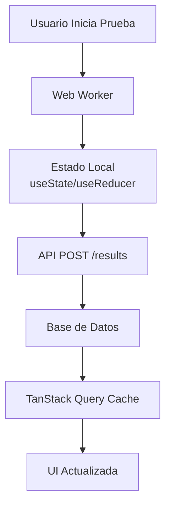
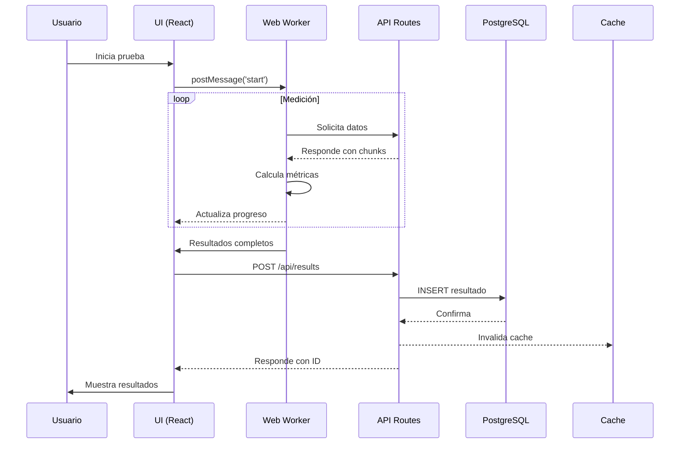

# 🏛️ Arquitectura de Red Neutral COL

## Visión General

Red Neutral COL está construido como una aplicación web moderna utilizando Next.js 15 con App Router, aprovechando las últimas características de React y patrones de arquitectura serverless.

## Stack Tecnológico

### Frontend

- **Framework**: Next.js 15 (App Router)
- **UI Library**: React 19
- **Lenguaje**: TypeScript 5
- **Estilos**: Tailwind CSS + shadcn/ui
- **Estado**: TanStack Query + React Context
- **Gráficos**: Recharts
- **Web Workers**: Para operaciones intensivas

### Backend

- **API**: Next.js API Routes
- **ORM**: Prisma
- **Base de Datos**: PostgreSQL (Supabase)
- **Validación**: Zod

### Infraestructura

- **Hosting**: Vercel
- **Base de Datos**: Supabase
- **CDN**: Vercel Edge Network

## Estructura del Proyecto

```
red-neutral-col/
├── src/
│   ├── app/                    # App Router pages
│   │   ├── api/               # API endpoints
│   │   ├── testing/           # Prueba de velocidad
│   │   ├── results/           # Resultados
│   │   └── share/             # Compartir
│   ├── components/            # React components
│   │   └── ui/               # shadcn/ui components
│   ├── lib/                   # Utilidades
│   └── types/                 # TypeScript types
├── public/                    # Assets estáticos
│   └── speedtest.worker.js   # Web Worker
├── prisma/                    # Schema y migraciones
└── docs/                      # Documentación
```

## Componentes Principales

### 1. Web Worker para Pruebas

El Web Worker maneja todas las operaciones de medición de velocidad de forma asíncrona:

```javascript
// public/speedtest.worker.js
- Medición de descarga/subida
- Cálculo de ping y jitter
- Pruebas de servicios específicos
- Comunicación con el thread principal
```

### 2. Sistema de Routing

Utilizamos Next.js App Router con las siguientes rutas principales:

```
/ - Página principal
/testing - Prueba de velocidad
/results/[id] - Resultados individuales
/share/[shareId] - Resultados compartidos
/api/* - Endpoints de API
```

### 3. Gestión de Estado



### 4. Flujo de Datos



## Patrones de Diseño

### 1. Server Components vs Client Components

- **Server Components**: Para contenido estático y fetch inicial de datos
- **Client Components**: Para interactividad y actualizaciones en tiempo real

### 2. API Design

- RESTful endpoints
- Respuestas JSON consistentes
- Manejo de errores estandarizado

### 3. Database Schema

```prisma
model TestResult {
  id                  String   @id @default(cuid())
  isp                 String
  city                String
  downloadSpeed       Float
  uploadSpeed         Float
  ping                Int
  jitter              Float
  throttlingRatio     Float?
  videoStreamingSpeed Float?
  socialMediaSpeed    Float?
  generalWebSpeed     Float?
  shareId             String?  @unique
  isPublic            Boolean  @default(false)
  sharedAt            DateTime?
  testDate            DateTime @default(now())
  createdAt           DateTime @default(now())
}
```

## Seguridad

### 1. Validación de Datos

- Validación en el cliente con Zod
- Validación en el servidor antes de guardar
- Sanitización de inputs

### 2. Protección de API

- Rate limiting por IP
- Validación de parámetros
- Sin datos sensibles expuestos

### 3. Privacidad

- No se almacenan datos personales
- Resultados anónimos
- Compartir es opcional

## Performance

### 1. Optimizaciones

- Web Workers para operaciones intensivas
- Lazy loading de componentes
- Optimización de imágenes con Next.js Image
- Cache de resultados con TanStack Query

### 2. Bundle Size

- Code splitting automático
- Tree shaking
- Minificación en producción

### 3. Métricas

- First Contentful Paint: < 1s
- Time to Interactive: < 2s
- Lighthouse Score: > 90

## Monitoreo y Logs

### 1. Error Tracking

```typescript
// Manejo global de errores
export function handleError(error: Error) {
  console.error('Error:', error);
  // Enviar a servicio de monitoreo si está configurado
}
```

### 2. Analytics

- Métricas de uso anónimas
- Performance monitoring
- Error rates

## Escalabilidad

### 1. Horizontal Scaling

- Serverless functions en Vercel
- Auto-scaling de base de datos en Supabase
- CDN global para assets

### 2. Límites

- Rate limiting por endpoint
- Tamaño máximo de payload
- Timeout de funciones

## Decisiones Técnicas

### 1. ¿Por qué Next.js 15?

- App Router para mejor performance
- React Server Components
- Built-in optimizaciones
- Excelente DX

### 2. ¿Por qué PostgreSQL?

- Relacional para datos estructurados
- Excelente performance
- Soporte completo en Supabase
- Prisma como ORM

### 3. ¿Por qué Web Workers?

- No bloquear el UI thread
- Mediciones más precisas
- Mejor UX durante las pruebas

## Futuras Mejoras

1. **Caché Distribuido**: Redis para resultados agregados
2. **WebSockets**: Actualizaciones en tiempo real
3. **PWA**: Soporte offline
4. **API Pública**: Rate-limited API para desarrolladores
5. **Webhooks**: Notificaciones de cambios
